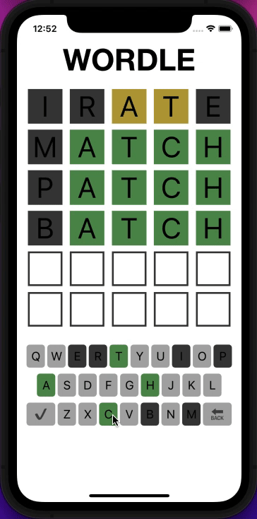
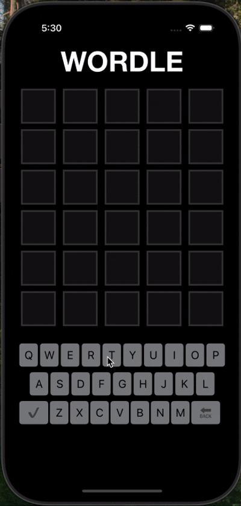
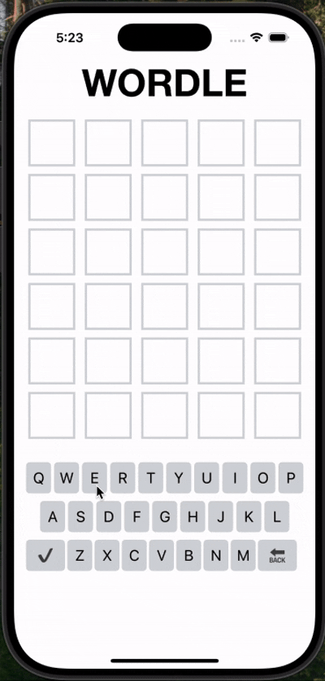

# Wordle

Learning iOS through trying to recreate wordle in a native iOS app.

Main takeaways from this project:
- Swift/xCode
- UICollection views(sizing and scaling items)
- Storyboards
- Unit test
- Some animation logic

## Losing example

## Dark Mode

## Error handling

